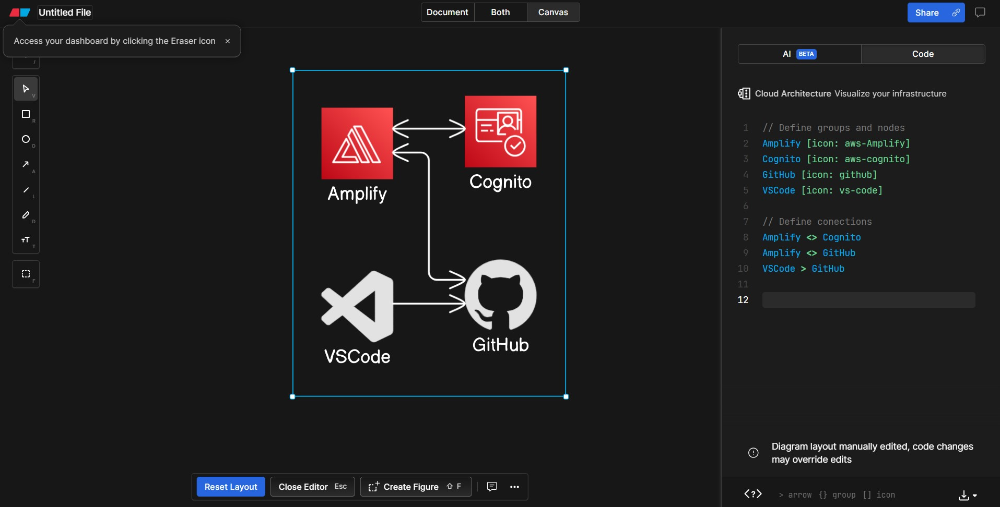
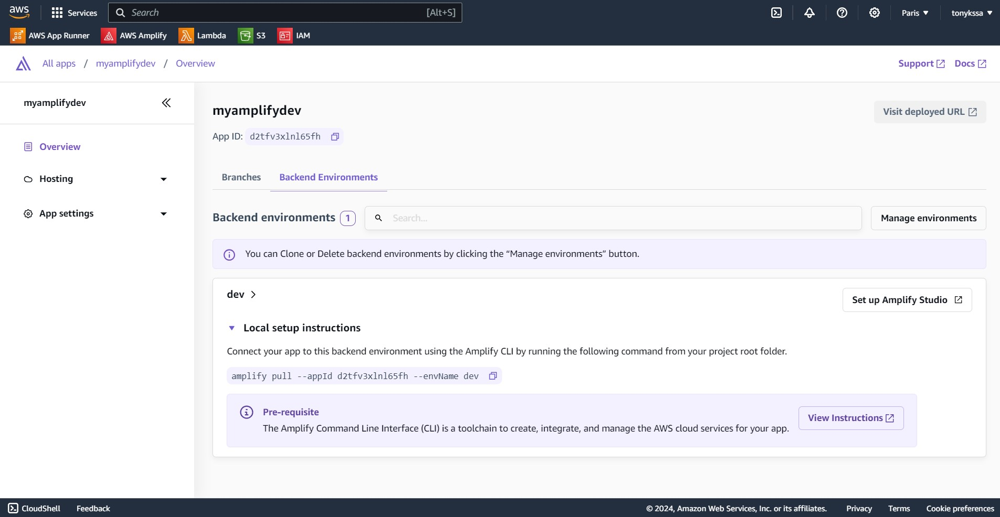

### Terminal Commands

- Setup the environment
    - npm install -g @aws-amplify/cli
    - amplify configure
    - npx create-react-app client
    - cd client
    - npm install aws-amplify @aws-amplify/ui-react
    - npm start

- Initialize amplify config 
    - amplify init
    - amplify add auth
    - amplify push

- Develop the Demo

    - Create a new repository on the command line
        ```
        git init
        git add .
        git commit -m "first commit"
        git branch -M main
        git remote add origin https://github.com/ameksike/tmp.git
        git push -u origin main
        ```
    - Push an existing repository from the command line
        ```
        git remote add origin https://github.com/ameksike/tmp.git
        git branch -M main
        git push -u origin main
        ```

### Code Files
- ```cognito-react\client\src\App.js```: The React application that's configured to use Cognito for authentication
- ```cognito-react\client\src\Quiz.js```: The Quiz component
- ```cognito-react\client\src\quizData.js```: The hard-coded questions and answers for the quiz

### System design
- [Eraser.io](https://app.eraser.io/workspace/E66Ksub1BkDxYb7mGIHT)

    ```
    // Define groups and nodes
    Amplify [icon: aws-Amplify]
    Cognito [icon: aws-cognito]
    GitHub [icon: github]
    VSCode [icon: vs-code]

    // Define conections 
    Amplify <> Cognito
    Amplify <> GitHub
    VSCode > GitHub
    ```





### Create the server side 

1. Create a policy for a Lambda to write into DynamoDB table
    ```json
    {
        "Version": "2012-10-17",
        "Statement": [
            {
                "Sid": "VisualEditor0",
                "Effect": "Allow",
                "Action": [
                    "dynamodb:PutItem",
                    "dynamodb:DeleteItem",
                    "dynamodb:GetItem",
                    "dynamodb:Scan",
                    "dynamodb:Query",
                    "dynamodb:UpdateItem"
                ],
                "Resource": "YOUR-TABLE-ARN"
            }
        ]
    }
    ```
2. Create a Lambda function as service

    ```py
    # import the JSON utility package
    import json
    # import the Python math library
    import math

    # import the AWS SDK (for Python the package name is boto3)
    import boto3
    # import two packages to help us with dates and date formatting
    from time import gmtime, strftime

    # create a DynamoDB object using the AWS SDK
    dynamodb = boto3.resource('dynamodb')
    # use the DynamoDB object to select our table
    table = dynamodb.Table('PowerOfMathDatabase')
    # store the current time in a human readable format in a variable
    now = strftime("%a, %d %b %Y %H:%M:%S +0000", gmtime())

    # define the handler function that the Lambda service will use an entry point
    def lambda_handler(event, context):

        # extract the two numbers from the Lambda service's event object
        mathResult = math.pow(int(event['base']), int(event['exponent']))

        # write result and time to the DynamoDB table using the object we instantiated and save response in a variable
        response = table.put_item(
            Item={
                'ID': str(mathResult),
                'LatestGreetingTime':now
                })

        # return a properly formatted JSON object
        return {
            'statusCode': 200,
            'body': json.dumps('Your result is ' + str(mathResult))
        }
    ```
3. Create the UI
    ```html
    <!DOCTYPE html>
    <html>
    <head>
        <meta charset="UTF-8">
        <title>To the Power of Math!</title>
        <!-- Styling for the client UI -->
        <style>
        h1 {
            color: #FFFFFF;
            font-family: system-ui;
            margin-left: 20px;
            }
        body {
            background-color: #222629;
            }
        label {
            color: #86C232;
            font-family: system-ui;
            font-size: 20px;
            margin-left: 20px;
            margin-top: 20px;
            }
        button {
            background-color: #86C232;
            border-color: #86C232;
            color: #FFFFFF;
            font-family: system-ui;
            font-size: 20px;
            font-weight: bold;
            margin-left: 30px;
            margin-top: 20px;
            width: 140px;
            }
        input {
            color: #222629;
            font-family: system-ui;
            font-size: 20px;
            margin-left: 10px;
            margin-top: 20px;
            width: 100px;
            }
        </style>
        <script>
            // callAPI function that takes the base and exponent numbers as parameters
            var callAPI = (base,exponent)=>{
                // instantiate a headers object
                var myHeaders = new Headers();
                // add content type header to object
                myHeaders.append("Content-Type", "application/json");
                // using built in JSON utility package turn object to string and store in a variable
                var raw = JSON.stringify({"base":base,"exponent":exponent});
                // create a JSON object with parameters for API call and store in a variable
                var requestOptions = {
                    method: 'POST',
                    headers: myHeaders,
                    body: raw,
                    redirect: 'follow'
                };
                // make API call with parameters and use promises to get response
                fetch("YOUR API GATEWAY ENDPOINT", requestOptions)
                .then(response => response.text())
                .then(result => alert(JSON.parse(result).body))
                .catch(error => console.log('error', error));
            }
        </script>
    </head>
    <body>
        <h1>TO THE POWER OF MATH!</h1>
        <form>
            <label>Base number:</label>
            <input type="text" id="base">
            <label>...to the power of:</label>
            <input type="text" id="exponent">
            <!-- set button onClick method to call function we defined passing input values as parameters -->
            <button type="button" onclick="callAPI(document.getElementById('base').value,document.getElementById('exponent').value)">CALCULATE</button>
        </form>
    </body>
    </html>
    ```
4. Create an API Gateway and assign the policy to the lambda

### Resources
- [Configure Amplify](https://docs.amplify.aws/gen1/javascript/tools/cli/start/set-up-cli/#configure-the-amplify-cli)
- [Tool: Eraser.io](https://app.eraser.io/workspace/E66Ksub1BkDxYb7mGIHT)
- [AWS Tutorial: Building a React App with Amplify, Cognito, and CI/CD with GitHub](https://www.youtube.com/watch?v=ma1FA2be8Ac)
- [Example](https://github.com/tinytechnicaltutorials/amplify-cognito-quiz)