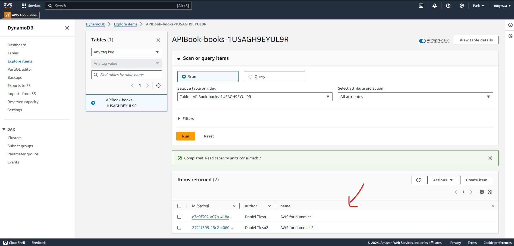

## SAM & VSCode
AWS Serverless Application Model (AWS SAM)

1. Create a project

    

2. Run in AWS from VSCode

    

3. Check DynamoDB in AWS

    

4. Delete the infrastructure 

    

5. Source code Example: 
    [Demo AWS SAM & VSCode](https://github.com/ameksike/demo.aws/tree/main/sam-vscode)

### Reference 
- [Plugin: AWS Toolkit ](https://marketplace.visualstudio.com/items?itemName=AmazonWebServices.aws-toolkit-vscode)
- Option: Open with Application Compose 
- [Tutorial: API Serverless](https://www.youtube.com/watch?v=2819CPaYC0Y)
